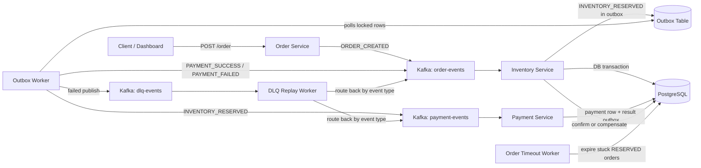

# Flashcart - Distributed Checkout Backend

Flashcart is a production-style distributed checkout backend built with Node.js, Kafka, PostgreSQL, Docker, and event-driven microservices.
It demonstrates a real checkout Saga with inventory reservation, payment processing, transactional outbox publishing, retries + DLQ replay, idempotent consumers, compensation, health checks, structured logs, and metrics.

It also includes a friendly dashboard so the system can be assessed like a live web project (create an order, observe state transitions, verify health, and inspect stats) without reading the entire codebase first.

Dashboard (local): `http://localhost:3000/`

## What You'll See

- A real `POST /order` entry point (used by the dashboard and scripts)
- Inventory reservation with PostgreSQL row locks for correctness under concurrency
- Payment processing + idempotency
- Transactional outbox pattern for durable event publication
- Retry + DLQ replay path for failed publishes
- Compensation for failures and timeouts
- Health and metrics endpoints for each service

## Table Of Contents

- Quickstart
- Architecture
- Services
- API And Endpoints
- Testing (Smoke + Load)
- Deploy
- Contributing
- Roadmap

## Quickstart (Local)

Prerequisites:

- Docker Desktop
- Node.js 20+ (only needed to run local scripts like load tests)

Start the full stack:

```powershell
docker compose up -d --build
```

Open the dashboard:

```text
http://localhost:3000/
```

Stop everything:

```powershell
docker compose down
```

Reset the database (fresh seed data):

```powershell
docker compose down -v
docker compose up -d --build
```

## Architecture



## Services

| Service | Responsibility | Port / endpoint |
| --- | --- | --- |
| Order Service | HTTP entry point, emits `ORDER_CREATED`, hosts dashboard, order lookup, stats, health, metrics | `3000` |
| Inventory Service | Reserves stock transactionally, writes outbox events, handles payment-result compensation | `4000` health |
| Payment Service | Processes payments, idempotently stores payment rows, writes payment result events to outbox | `4001` health |
| Outbox Worker | Publishes outbox events to Kafka (`SKIP LOCKED`), sends failures to DLQ | `4002` health |
| DLQ Replay Worker | Replays DLQ events with retry count + exponential backoff | `4003` health |
| Order Timeout Worker | Marks stale `RESERVED` orders as `FAILED` and restores inventory | `4004` health |

## Data Model

Core tables:

- `inventory(product_id, stock)`
- `orders(id, product_id, quantity, status, created_at, updated_at)`
- `payments(order_id UNIQUE, status, created_at, updated_at)`
- `outbox(event_type, payload, processed, retry_count, last_error)`

Schema + seed data live in:

```text
database/init.sql
```

## Kafka Topics

- `order-events`
- `payment-events`
- `dlq-events`

## API And Endpoints

Create an order:

```powershell
Invoke-RestMethod -Method Post http://localhost:3000/order `
  -ContentType "application/json" `
  -Body '{"productId":"p1","quantity":1}'
```

Get order status:

```powershell
Invoke-RestMethod http://localhost:3000/order/<order-id>
```

Stats:

```powershell
Invoke-RestMethod http://localhost:3000/api/stats
```

Aggregated health:

```powershell
Invoke-RestMethod http://localhost:3000/api/health/services
```

Metrics:

```powershell
Invoke-RestMethod http://localhost:3000/metrics
Invoke-RestMethod http://localhost:4001/metrics
```

## Testing (Smoke + Load)

Smoke test (checks service health + runs one real order):

```powershell
.\scripts\smoke-test.ps1
```

Load test:

```powershell
$env:TOTAL_ORDERS=500
$env:CONCURRENCY=25
node scripts\load-test.js
```

The script prints JSON like:

```json
{
  "event": "load_test_finished",
  "totalOrders": 500,
  "concurrency": 25,
  "durationSeconds": 39.36,
  "throughputOrdersPerSecond": 12.7,
  "summary": {
    "CONFIRMED": 8,
    "FAILED": 467,
    "TIMEOUT": 25
  }
}
```

## Troubleshooting

Common reasons for high `FAILED` counts in the load test:

- Inventory depleted due to repeated runs (reset with `docker compose down -v`)
- Kafka consumers not ready (check `/api/health/services`)
- Order timeouts under load (watch logs; tune `ORDER_TIMEOUT_SECONDS` and outbox settings)

## Deploy

For a friendly demo, a small VM running Docker Compose is the simplest and most realistic setup (Kafka + multiple workers + Postgres).

High-level steps:

1. Provision a small Linux VM (EC2 / Lightsail / DigitalOcean / any VPS)
2. Install Docker and Docker Compose
3. Clone the repo and create `.env` from `.env.example`
4. Run `docker compose up -d --build`
5. Expose port `3000` (or front it with Nginx/Caddy and use HTTPS)

## Contributing

Want to help push this project further? Contributions are welcome.
If you're interested, open an issue describing what you want to implement and I will coordinate the design and review.

Good starter areas:

- Tracing, dashboards, and log aggregation
- CI pipelines for smoke tests on PRs
- Kafka topic bootstrap scripts (partitions/retention)
- Deployment manifests (Kubernetes or ECS)

## Roadmap (Upgrades)

- OpenTelemetry traces across HTTP and Kafka messages
- Prometheus + Grafana dashboards
- Centralized logs with Loki or ELK
- Kafka topic creation script with partitions and retention policies
- Real payment gateway adapter behind an interface
- CI pipeline that runs smoke tests on PRs
- Kubernetes manifests or ECS task definitions
- Secret management instead of plain `.env`
