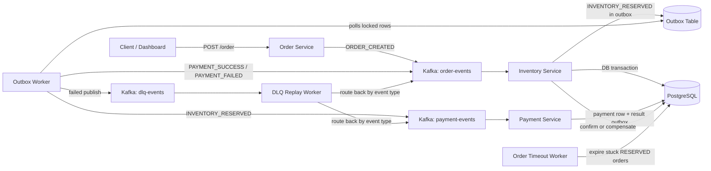

# Flashcart Distributed Checkout Backend

Flashcart is a production-style distributed checkout backend built with Node.js, Kafka, PostgreSQL, Docker, and event-driven microservices. It demonstrates a real checkout Saga with inventory reservation, payment processing, transactional outbox publishing, retry, DLQ replay, idempotent consumers, compensation, health checks, structured logs, and metrics.

The project also includes a recruiter-friendly dashboard at `http://localhost:3000/` so the system can be assessed like a live web project: create an order, watch recent order state, view service health, and see backend stats without needing to understand every terminal command first.

## Recruiter Demo

After deployment, share the public URL for the Order Service dashboard.

Local demo:

```powershell
docker compose up -d --build
```

Open:

```text
http://localhost:3000/
```

The dashboard shows:

- Live order creation through the real `POST /order` API
- Recent order status from PostgreSQL
- Service health across all microservices
- Order counts, confirmed/failed counts, and pending outbox messages
- The event flow used by the Saga

## Architecture



## Services

| Service | Responsibility | Public/local port |
| --- | --- | --- |
| Order Service | HTTP entry point, emits `ORDER_CREATED`, exposes dashboard, order lookup, stats, health, metrics | `3000` |
| Inventory Service | Consumes `ORDER_CREATED`, reserves stock transactionally, writes outbox events, handles payment result compensation | `4000` health |
| Payment Service | Consumes `INVENTORY_RESERVED`, idempotently stores payment rows, writes payment result events to outbox | `4001` health |
| Outbox Worker | Polls unprocessed outbox rows using `FOR UPDATE SKIP LOCKED`, publishes events to Kafka, sends failures to DLQ | `4002` health |
| DLQ Replay Worker | Consumes `dlq-events`, increments `retryCount`, applies exponential backoff, routes event back to correct topic | `4003` health |
| Order Timeout Worker | Marks stale `RESERVED` orders as `FAILED` and restores inventory | `4004` health |

## Production-Grade Features

- Event-driven Saga across independently running services
- PostgreSQL row locks for stock correctness under concurrent orders
- Transactional outbox for durable event publication
- Idempotent consumers using DB checks and unique constraints
- Retry and DLQ replay path for Kafka publish failures
- Compensation logic for failed payments and timed-out reservations
- Dockerized microservices with health checks and restart policies
- Environment-driven config through `.env`
- Structured JSON logs with service names and operational context
- Prometheus-style `/metrics` endpoints
- Recruiter-facing dashboard served from the backend entrypoint
- Smoke and load test scripts for measurable claims

## Database Schema

Core tables:

- `inventory(product_id, stock)`
- `orders(id, product_id, quantity, status, created_at, updated_at)`
- `payments(order_id UNIQUE, status, created_at, updated_at)`
- `outbox(event_type, payload, processed, retry_count, last_error)`

The schema is initialized by:

```text
database/init.sql
```

## Kafka Topics

- `order-events`
- `payment-events`
- `dlq-events`

## Run Locally

Prerequisites:

- Docker Desktop
- Node.js 20+ if you want to run scripts locally

Start the full stack:

```powershell
cd "C:\Users\thesh\OneDrive\Desktop\InternFolder\Product Based Company\flashcart"
docker compose up -d --build
```

Check containers:

```powershell
docker compose ps
```

Open the demo dashboard:

```text
http://localhost:3000/
```

Stop the stack:

```powershell
docker compose down
```

Reset the database volume:

```powershell
docker compose down -v
docker compose up -d --build
```

## Health Checks

```powershell
Invoke-RestMethod http://localhost:3000/health
Invoke-RestMethod http://localhost:3000/api/health/services
```

Individual health endpoints:

```text
http://localhost:3000/health
http://localhost:4000/health
http://localhost:4001/health
http://localhost:4002/health
http://localhost:4003/health
http://localhost:4004/health
```

## API

Create an order:

```powershell
Invoke-RestMethod -Method Post http://localhost:3000/order `
  -ContentType "application/json" `
  -Body '{"productId":"p1","quantity":1}'
```

Get order status:

```powershell
Invoke-RestMethod http://localhost:3000/order/<order-id>
```

Get dashboard stats:

```powershell
Invoke-RestMethod http://localhost:3000/api/stats
```

Metrics:

```powershell
Invoke-RestMethod http://localhost:3000/metrics
Invoke-RestMethod http://localhost:4001/metrics
```

## Verification Scripts

Run the smoke test:

```powershell
.\scripts\smoke-test.ps1
```

Run a small load test:

```powershell
$env:TOTAL_ORDERS=100
$env:CONCURRENCY=10
node scripts\load-test.js
```

The load test prints measured output like:

```json
{
  "event": "load_test_finished",
  "totalOrders": 100,
  "concurrency": 10,
  "durationSeconds": 18.42,
  "throughputOrdersPerSecond": 5.43,
  "summary": {
    "CONFIRMED": 71,
    "FAILED": 29,
    "TIMEOUT": 0
  }
}
```

Use your own measured output in the resume. Do not copy sample numbers unless you actually ran that exact test.

## Reliability Tests To Show

These are the tests recruiters care about because they prove the architecture works, not just the happy path.

1. **End-to-end Saga**
   - Create an order from the dashboard.
   - Show it reaches `CONFIRMED` or `FAILED`.
   - If failed, show inventory is restored.

2. **Duplicate event idempotency**
   - Publish the same `ORDER_CREATED` event twice.
   - Verify only one `orders` row exists and stock is deducted once.

3. **Outbox durability**
   - Stop Kafka.
   - Create or queue events.
   - Restart Kafka.
   - Verify the outbox worker drains pending rows.

4. **DLQ replay**
   - Force publish failure or inject a DLQ event.
   - Verify `retryCount` increments and the event routes back to the correct Kafka topic.

5. **Timeout compensation**
   - Lower `ORDER_TIMEOUT_SECONDS`.
   - Create a stuck `RESERVED` order.
   - Verify it becomes `FAILED` and stock is restored.

## Evidence From Local Verification

In the current verified run:

- Docker Compose built service images successfully.
- All six service health endpoints returned `ok`.
- A real order reached `CONFIRMED`.
- A failed payment restored product inventory.
- A duplicate `ORDER_CREATED` Kafka test produced one order row and one stock deduction.
- Outbox pending count returned to `0` after processing.

Keep a screenshot folder in your portfolio or GitHub README with:

- Dashboard showing recent orders and service health
- `docker compose ps` showing all containers healthy/running
- `/api/health/services` JSON output
- `/api/stats` JSON output after test orders
- `node scripts/load-test.js` output
- Kafka/Postgres logs showing structured JSON events

## Deploy Online

For this kind of project, the best recruiter-visible deployment is a small VM running Docker Compose. Platforms like Render/Railway are good for simple web apps, but Kafka plus multiple workers is much easier and more realistic on AWS EC2, AWS Lightsail, DigitalOcean Droplet, or any VPS.

Recommended deployment:

1. Push this project to GitHub.
2. Create a small Ubuntu VM.
3. Install Docker and Docker Compose.
4. Clone the repository.
5. Create `.env` from `.env.example`.
6. Run:

```bash
docker compose up -d --build
```

7. Open firewall/security group:
   - For a simple demo: allow TCP `3000`
   - For production polish: put Nginx/Caddy in front and allow only `80` and `443`

8. Share:

```text
http://<server-ip>:3000/
```

For a more production-like public URL:

- Buy or use a free domain/subdomain.
- Point DNS `A` record to the VM public IP.
- Run Caddy or Nginx as a reverse proxy to `order-service:3000`.
- Use HTTPS.

Cloud option summary:

| Platform | Fit | Notes |
| --- | --- | --- |
| AWS EC2 / Lightsail | Best | Runs full Docker Compose with Kafka, workers, Postgres, and dashboard |
| DigitalOcean Droplet | Best | Simple VPS deployment, good for recruiter demos |
| Railway | Possible | Use managed Postgres and external Kafka provider; deploy each service separately |
| Render | Possible but less ideal | Needs separate services and external Kafka; not a simple one-click Compose deployment |
| AWS ECS | Strong production option | More complex, best if you want to show cloud-native deployment |

## Production Hardening Roadmap

Already implemented:

- Containerization
- Health endpoints
- Structured logs
- Metrics endpoints
- Outbox pattern
- DLQ replay
- Idempotent consumers
- Compensation
- Service restart policies

Next upgrades if you want to push this further:

- OpenTelemetry traces across HTTP and Kafka messages
- Prometheus + Grafana dashboards
- Centralized logs with Loki or ELK
- Kafka topic creation script with partitions and retention policies
- Real payment gateway adapter behind an interface
- CI pipeline that runs smoke tests on PRs
- Kubernetes manifests or ECS task definitions
- Secret management instead of plain `.env`

## Resume Bullets

Use bullets like these, but replace numbers with your measured results:

- Built a Dockerized event-driven checkout backend with 6 Node.js microservices, Kafka, PostgreSQL, Saga orchestration, transactional outbox, retry, DLQ replay, and compensation logic.
- Implemented idempotent Kafka consumers using PostgreSQL row locks and unique constraints, preventing duplicate stock deductions under repeated events.
- Added production observability with JSON logs, health endpoints, metrics endpoints, and a live recruiter demo dashboard for operational visibility.
- Verified reliability under duplicate events, failed payments, and service restarts; measured `X` orders/sec using a scripted load test with `Y` concurrent clients.

Example project line:

```text
Flashcart - Distributed Checkout Backend | Node.js, Kafka, PostgreSQL, Docker
Live: https://your-domain.com | GitHub: https://github.com/your-name/flashcart
```

## How To Quantify Honestly

Run the load test on the same machine or VM you mention:

```powershell
$env:TOTAL_ORDERS=500
$env:CONCURRENCY=25
node scripts\load-test.js
```

Record:

- Total orders
- Concurrency
- Duration
- Throughput in orders/sec
- Confirmed/failed/timeout counts
- Machine type, for example `AWS t3.small` or `local i5 laptop`

Resume-safe wording:

```text
Measured 500 checkout requests at 25-way concurrency on an AWS t3.small demo VM, sustaining X orders/sec with 0 timed-out Saga executions.
```

This tells recruiters the number was measured, where it was measured, and what reliability condition mattered.
